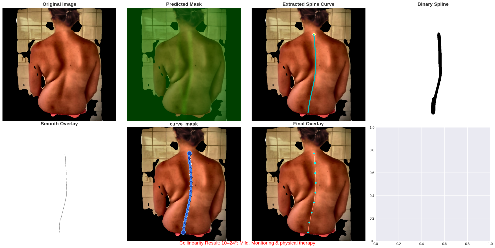
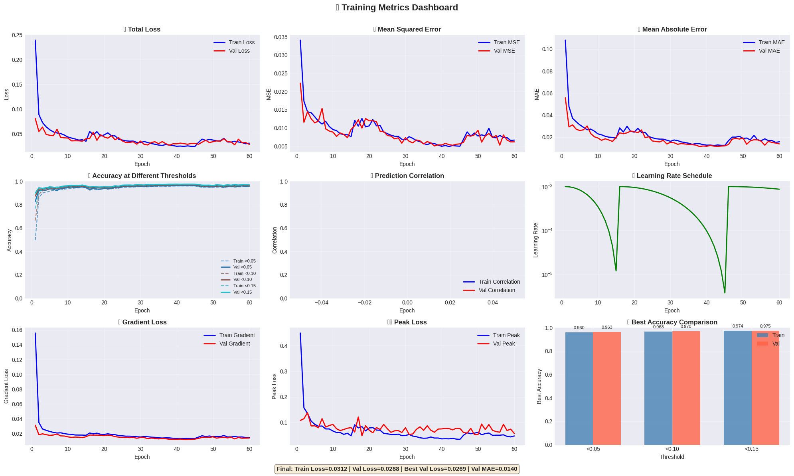

# spineDetec

This project implements an advanced medical image segmentation system specifically designed for automatic spine vertebrae detection and curve analysis from RGB X-ray images, with robust small dataset handling capabilities. The system leverages a U-Net architecture with EfficientNetV2 backbone enhanced with specialized modules optimized for training with limited annotated data.

#Test

#Metric

